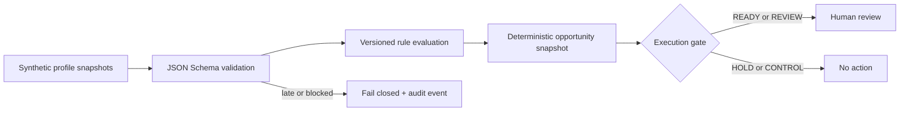

# Governed Growth Workbench Blueprint

[](https://github.com/agent-blueprint-lab/governed-growth-workbench-blueprint/actions/workflows/ci.yml)
[](LICENSE)

A small, runnable reference implementation for rule-first growth decisions with privacy guardrails, deterministic replay, fail-closed data handling, and mandatory human review.

**Project status:** early-stage reference implementation. This repository does not claim production deployments, external users, downloads, or broad adoption.

[中文说明](README.zh-CN.md)

## Why this exists

Many automation projects jump from available data to model-generated outreach. This project demonstrates a narrower and auditable sequence:

1. validate a minimal synthetic profile contract;
2. evaluate versioned, deterministic rules;
3. freeze evidence and experiment assignment;
4. stop on unavailable data or contact restrictions;
5. route every actionable result to human review;
6. record machine-readable audit events.

The implementation does not connect to a database, model API, CRM, messaging channel, or payment system. It cannot contact anyone or change an external system.



## Quick start

Requires Python 3.11 or newer.

```bash
python -m venv .venv
source .venv/bin/activate
python -m pip install -e .
make verify
```

`make verify` compiles the package, scans public files for common sensitive-data patterns, runs the executable test suite, and writes a deterministic demo replay to `build/`.

Run the demo directly:

```bash
ggw run \
  --profiles examples/profiles.synthetic.json \
  --rules config/rules.synthetic.json \
  --output build/opportunities.json \
  --audit-output build/audit-events.json
```

Generate a new deterministic synthetic dataset:

```bash
ggw generate-synthetic \
  --count 12 \
  --seed 7 \
  --snapshot-date 2026-01-15 \
  --output build/profiles.synthetic.json
```

Open `web/index.html` locally for a static interface illustration. The UI is intentionally disconnected from real services.

## Inputs and outputs

- `examples/profiles.synthetic.json`: synthetic daily profile snapshots.
- `config/rules.synthetic.json`: demo-only rules and lifecycle parameters.
- `examples/opportunities.json`: expected deterministic opportunity snapshot.
- `schemas/`: JSON Schema contracts for profiles, rules, opportunities, and audit events.

Every public sample identifier starts with `SYN-`. The rule file must contain `"synthetic_demo_only": true`; otherwise validation fails. Numeric demo parameters are arbitrary test fixtures, not recommended operating thresholds.

The engine returns four execution states:

| State | Meaning |
| --- | --- |
| `READY` | Data and contact gates pass; a human may review the opportunity. |
| `REVIEW` | Identity, relationship, or contact permission is unresolved. |
| `HOLD` | A contact restriction prevents action. |
| `CONTROL` | The subject is in a deterministic experiment control group. |

Profiles with `late` or `blocked` data status produce no opportunity. They produce only a `data_blocked` audit event.

## Repository map

```text
config/      Synthetic rule configuration and local publication denylist
docs/        Architecture, governance, threat model, and maintainer workflow
examples/    Synthetic inputs and deterministic expected output
prompts/     Optional governed explanation policy; no model client is included
schemas/     Public JSON Schema contracts
src/         Reference engine, CLI, generator, validation, and publication scan
tests/       Executable safety, replay, schema, and generator tests
web/         Offline static UI illustration
.github/     CI, release automation, contribution templates, and ownership
```

## Security and governance guarantees

- Rule outputs never trigger external actions.
- A non-ready data state fails closed.
- Contact restrictions override priority and value tiers.
- Control-group assignment is stable for the same subject and rule-set version.
- Inputs, rules, opportunities, and audit events are schema-validated.
- Publication scanning blocks common contact, credential, private-network, and local-path patterns.
- Real organization names can be added to `config/publication-denylist.txt` in a private fork before public release.

This reference scanner is a guardrail, not a complete data-loss-prevention system. Review the [security policy](SECURITY.md), [threat model](docs/threat-model.md), and [publication checklist](docs/publication-safety-checklist.md) before adapting the project.

## Contributing and maintenance

Use a bug or rule-proposal issue, make changes through a pull request, and run `make verify`. Security reports and accidental sensitive-data exposure must use a private GitHub Security Advisory, not a public issue.

See [CONTRIBUTING.md](CONTRIBUTING.md), [GOVERNANCE.md](GOVERNANCE.md), [ROADMAP.md](ROADMAP.md), and [CHANGELOG.md](CHANGELOG.md).

## License

MIT. See [LICENSE](LICENSE).
