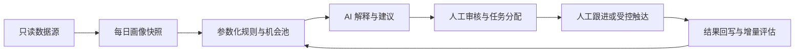

# Governed Growth Workbench Blueprint

一套面向存量用户运营的、可审计的增长决策工作台参考实现。它把分散的事实数据转换成每日画像快照、规则机会、AI 解释建议和人工任务，并通过对照组与结果回写验证增量效果。

> 本仓库仅包含通用方法、合成数据和示例代码。没有任何真实公司、客户、账号、业务表、内部域名、联系方式、金额明细或生产环境配置。

## 为什么需要它

许多增长系统直接从“有数据”跳到“让模型自动触达”。本蓝图采用更稳妥的顺序：

1. SQL/规则计算可验证事实；
2. 参数化规则生成候选机会；
3. AI 只做解释、排序建议和沟通草稿；
4. 负责人审核、分配或导出任务；
5. 冻结入池快照，用实验结果验证规则；
6. 数据充分后，再评估预测模型或自动化执行。



## 核心边界

- 规则先行：首期不依赖黑盒预测分数。
- AI 不改事实：AI 不得补造身份、需求、关系、收入或意愿。
- 人工执行：默认不直接调用短信、邮件、CRM 写入或支付接口。
- 最小必要：提示词不包含电话、邮箱、详细地址、原始咨询内容或付款明细。
- 可追溯：每条机会都保存画像日期、规则版本、证据字段、审核人与结果。
- 可回滚：规则参数与页面版本均可恢复，异常数据只报警、不生成执行名单。

## 仓库结构

```text
docs/       架构、流程、角色、模型与安全说明
schemas/    画像快照、机会、决策和审计事件 JSON Schema
prompts/    受治理的 Agent 系统策略
examples/   纯合成数据示例
tests/      安全与验收场景
web/        可直接打开的静态交互演示
```

## 快速查看

直接用浏览器打开 `web/index.html`。页面中的名称、数量、分值、阈值和任务状态全部为合成演示数据，不代表任何真实业务表现。

## 从规则到模型的升级门槛

预测模型只有在以下条件同时满足时，才建议进入影子评估：

- 统一主体 ID 和稳定的历史快照；
- 明确的正负样本定义与观察窗口；
- 至少一个可复现的规则基线；
- 时间外验证、校准度、覆盖率和分群公平性检查；
- 模型失败时可回退到规则；
- 通过隐私、安全和人工审核评审。

模型在影子阶段不得改变生产名单、实验对照组或触达动作。

## 适用与不适用

适用于：续费/复购提示、使用中断核验、重点账户识别、合作候选、人工任务分配和增量复盘。

不适用于：未经审核的自动营销、敏感个人画像、法律/医疗/信贷结论、基于受保护属性的差别对待，或任何无法说明证据来源的“智能判断”。

## License

MIT。详见 [LICENSE](LICENSE)。
